# LearningSteps Lockdown - End-to-End Security Hardening

## Project Overview

This project documents the complete security hardening of the LearningSteps API, a FastAPI application running on Azure. Starting from an intentionally insecure deployment, we implemented a multi-layered security architecture following the **Defense in Depth** principle.

> **Role:** Lead Security Engineer
> **Environment:** Azure (West Europe)
> **Stack:** Ubuntu 22.04, FastAPI, PostgreSQL 16, Nginx, oauth2-proxy, Microsoft Sentinel

---

## Architecture Evolution

### Before (Insecure Baseline)

- VM exposed directly to internet with public IP
- SSH accessible from any IP with a static key file
- API completely anonymous, no authentication
- PostgreSQL accessible from anywhere on port 5432
- No logging, no monitoring, no alerting

### After (Hardened)

- Internet to NSG (443 only) to Nginx (TLS+WAF+RateLimit) to oauth2-proxy (JWT) to FastAPI to PostgreSQL (private VNet)
- Management: Azure Bastion to VM (Entra ID identity)
- Monitoring: Azure Monitor to Log Analytics to Microsoft Sentinel to Logic App to NSG (auto-block)

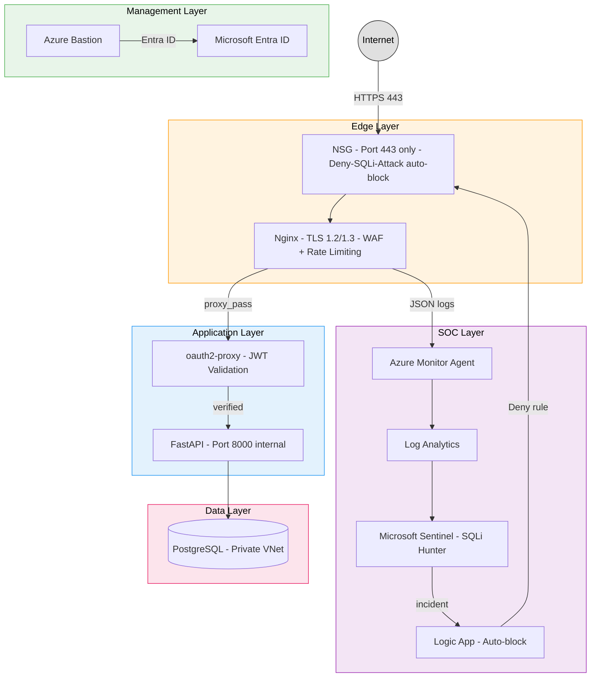

    ```mermaid
graph TB
    Internet((Internet))

    subgraph Edge["Edge Layer"]
        NSG["NSG\nPort 443 only\nDeny-SQLi-Attack auto-block"]
        Nginx["Nginx\nTLS 1.2/1.3\nWAF + Rate Limiting"]
    end

    subgraph App["Application Layer"]
        OAuth["oauth2-proxy\nJWT Validation"]
        API["FastAPI\nPort 8000 internal"]
    end

    subgraph Data["Data Layer"]
        DB[("PostgreSQL\nPrivate VNet")]
    end

    subgraph Mgmt["Management Layer"]
        Bastion["Azure Bastion"]
        EntraID["Microsoft Entra ID"]
    end

    subgraph SOC["SOC Layer"]
        AMA["Azure Monitor Agent"]
        LAW["Log Analytics"]
        Sentinel["Microsoft Sentinel\nSQLi Hunter"]
        LogicApp["Logic App\nAuto-block"]
    end

    Internet -->|HTTPS 443| NSG
    NSG --> Nginx
    Nginx -->|proxy_pass| OAuth
    OAuth -->|verified| API
    API --> DB
    Bastion -->|Entra ID| EntraID
    Nginx -->|JSON logs| AMA
    AMA --> LAW
    LAW --> Sentinel
    Sentinel -->|incident| LogicApp
    LogicApp -->|Deny rule| NSG

    style Internet fill:#e0e0e0,stroke:#333,color:#000
    style Edge fill:#fff3e0,stroke:#ff9800,color:#000
    style App fill:#e3f2fd,stroke:#2196f3,color:#000
    style Data fill:#fce4ec,stroke:#e91e63,color:#000
    style Mgmt fill:#e8f5e9,stroke:#4caf50,color:#000
    style SOC fill:#f3e5f5,stroke:#9c27b0,color:#000
```

---

## Security Layers

### Layer 1 - Perimeter and Management Plane

**Problem:** Port 22 open to the world, static SSH key on disk.
**Solution:** Removed public IP from VM entirely. Access only via Azure Bastion using Microsoft Entra ID identity.

| Component | Implementation |
|-----------|---------------|
| VM Access | Azure Bastion Standard (tunneling enabled) |
| Authentication | Microsoft Entra ID (AADSSHLoginForLinux extension) |
| Authorization | RBAC role: Virtual Machine Administrator Login |
| Network | NSG port 22 restricted to specific IP + Bastion subnet only |
| Protection | Resource Lock (CanNotDelete) on VNet |

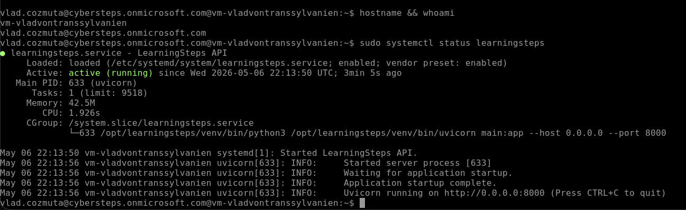

---

### Layer 2 - API Identity Gateway

**Problem:** Any anonymous request could read, modify, or delete data.
**Solution:** Deployed oauth2-proxy as a security sidecar that validates Microsoft Entra ID JWT tokens before forwarding any request to FastAPI.

| Component | Implementation |
|-----------|---------------|
| Identity Provider | Microsoft Entra ID (single tenant) |
| Token Type | Bearer JWT (v2.0 access tokens) |
| Proxy | oauth2-proxy v7.6.0 on port 4180 |
| App Registration | api://1a557f7c-0ac6-4232-8ecd-e3ed0fe7321f |
| NSG | Port 8000 removed, FastAPI not directly accessible |

**Test Results:**
- Anonymous request: 302 redirect to Microsoft login
- Invalid token: 302 redirect to Microsoft login
- Valid Entra ID token: 200 OK with data

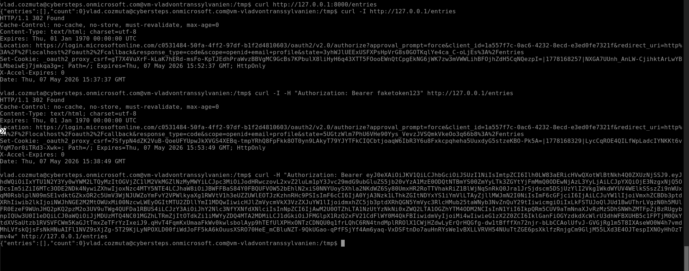

---

### Layer 3 - Data Isolation

**Problem:** PostgreSQL had a public IP and a firewall rule allowing all connections.
**Solution:** Migrated database to VNet Integration with private DNS zone. Zero public exposure.

| Component | Implementation |
|-----------|---------------|
| Network | VNet Integration (snet-db 10.0.3.0/24, delegated) |
| DNS | Private DNS Zone: vladvontranssylvanien.private.postgres.database.azure.com |
| Public Access | Disabled |
| Migration | pg_dump to restore via psql from within VNet |

**Test Results:**
- Connection from VM: 200 OK, 5 entries returned
- Connection from internet: DNS resolution fails, host not known

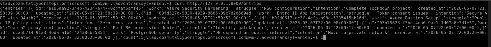
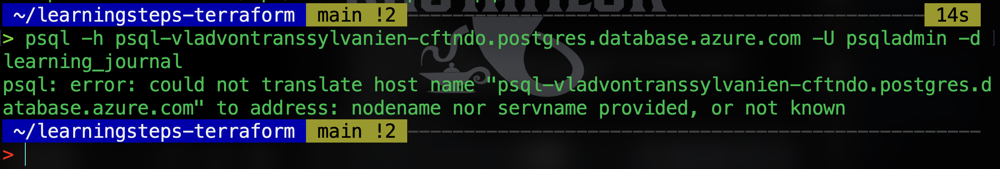

---

### Layer 4 - Edge Security

**Problem:** oauth2-proxy exposed directly on port 80, no encryption, no WAF.
**Solution:** Nginx edge proxy with TLS, security headers, rate limiting, and custom WAF rules.

| Component | Implementation |
|-----------|---------------|
| TLS | Self-signed certificate, TLS 1.2/1.3 only |
| HSTS | max-age=31536000; includeSubDomains |
| Security Headers | X-Content-Type-Options, X-Frame-Options: DENY |
| Rate Limiting | 10 req/s, burst 20, returns 429 |
| WAF | Custom Nginx map rules blocking SQLi and XSS |
| Fail2Ban | Bans IPs with 10+ 403 errors in 60 seconds for 1 hour |

**WAF Note:** ModSecurity OWASP CRS was unavailable as a precompiled package for Nginx 1.18 on Ubuntu 22.04. A custom WAF was implemented using Nginx map directives, functionally equivalent to OWASP CRS rules 942100 (SQLi) and 941100 (XSS).

**Test Results:**
- HTTPS request: 302 with HSTS and security headers
- SQLi attempt: 403 Forbidden
- Rapid requests: 429 Too Many Requests

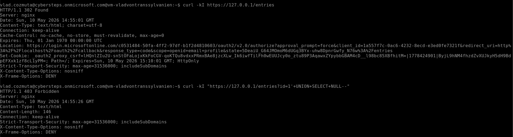
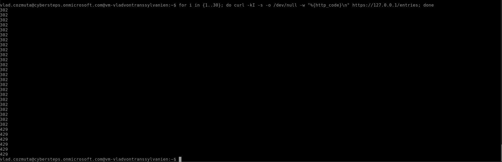

---

### Layer 5 - Monitoring and Automated Incident Response

**Problem:** Logs siloed on VM. No visibility. No automated response.
**Solution:** Full cloud-native SOC with Microsoft Sentinel and automated IP blocking.

| Component | Implementation |
|-----------|---------------|
| Log Format | Nginx JSON structured logging |
| Transport | rsyslog to Azure Monitor Agent to Log Analytics |
| SIEM | Microsoft Sentinel on law-vladvontranssylvanien |
| DCR | Data Collection Rule streaming local7 syslog |
| Analytics Rule | KQL query detecting 10+ SQLi attempts in 30 min from single IP |
| Automation | Logic App Playbook with Managed Identity |
| Response | Auto-creates Deny rule in NSG for attacker IP |

**KQL Query (SQLi Hunter):**

    Syslog
    | where TimeGenerated >= ago(30m)
    | where Facility == "local7"
    | where SyslogMessage has "UNION" and SyslogMessage has "403"
    | extend cleanMsg = extract(@'nginx: ({.*})', 1, SyslogMessage)
    | extend payload = parse_json(cleanMsg)
    | extend ClientIp = tostring(payload.remote_addr)
    | where isnotempty(ClientIp)
    | summarize AttemptCount = count() by ClientIp
    | where AttemptCount > 10

**Test Results:**
- 50 SQLi requests sent: Sentinel incident generated (High severity)
- Logic App triggered: NSG rule Deny-SQLi-Attack created automatically

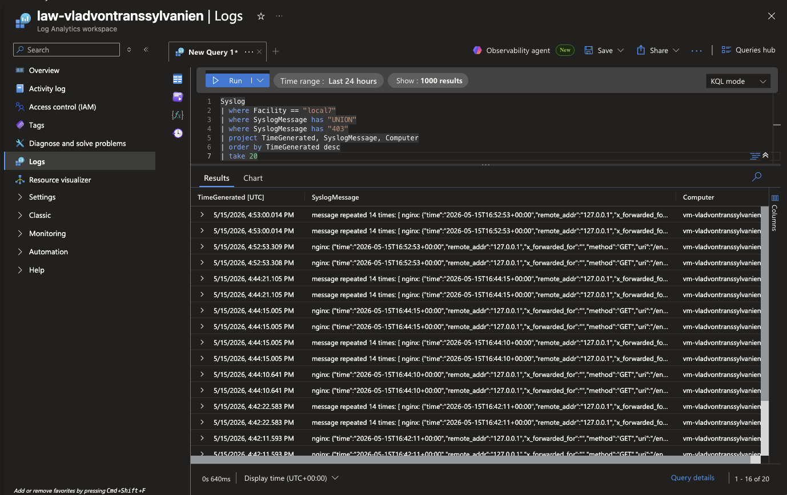
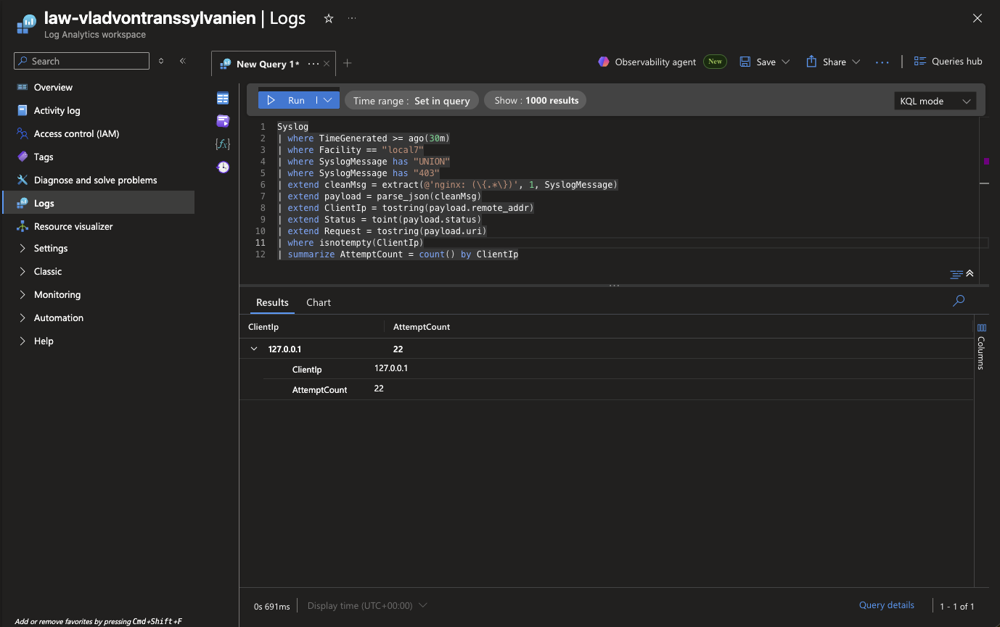
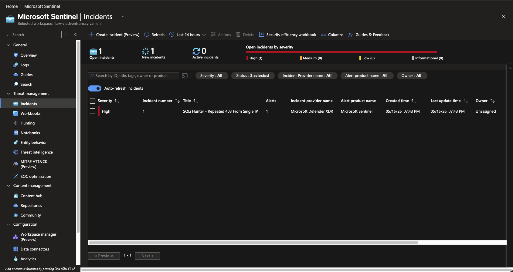
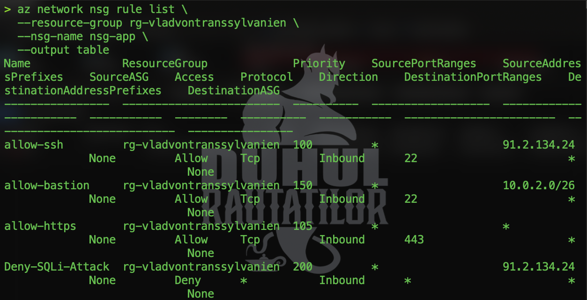

---

## Bonus Features

| Feature | Implementation |
|---------|---------------|
| Resource Lock | CanNotDelete on VNet, deletion blocked with ScopeLocked error |
| Activity Logs | Azure Monitor tracks all NSG modifications with caller and timestamp |
| Fail2Ban | OS-level IP banning based on Nginx 403 patterns |
| Automated SOC | Full attack-to-block pipeline without human intervention |

---

## Files Modified

| File | Change |
|------|--------|
| vm.tf | Removed public IP from NIC (Azure Policy compliance) |
| outputs.tf | Updated to private IP and az ssh command |

---

## Deployment

    git clone https://github.com/VladvonTranssylvanien/learningsteps-lockdown
    cd learningsteps-lockdown
    python3 deploy.py

After base deployment, apply security hardening as documented above.
